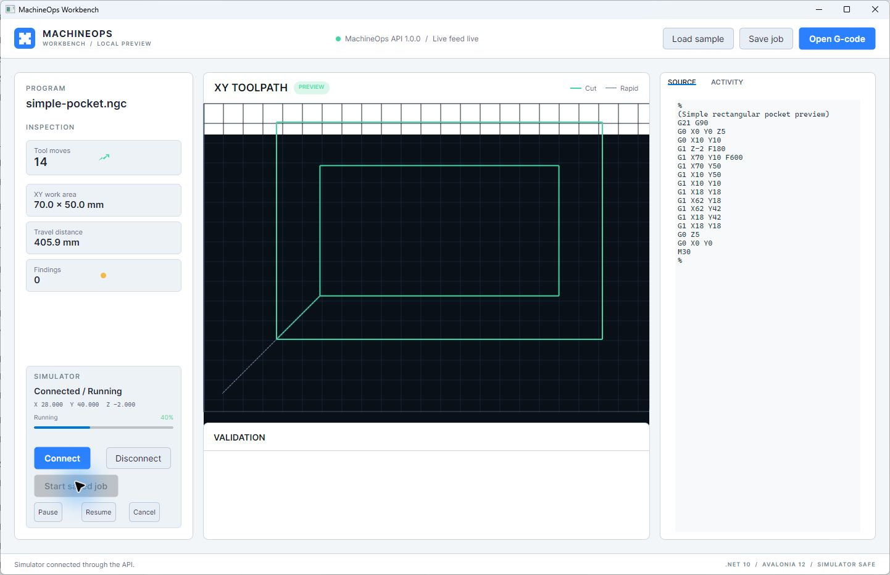
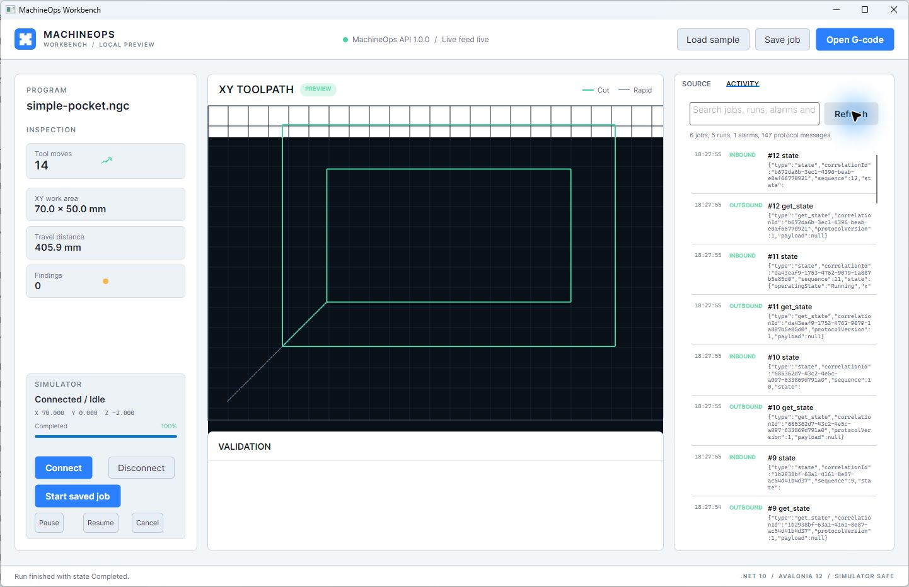
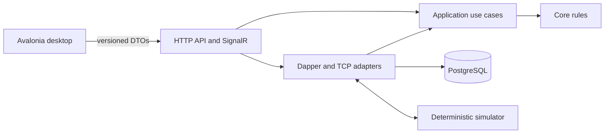

# MachineOps Workbench

MachineOps Workbench is a cross-platform job execution and diagnostics console
for simulated GRBL-class controllers. It explores how the workflow class
represented by traditional Java desktop G-code senders can be structured using
modern .NET boundaries, persistent history, remote APIs, and reproducible
testing.

It solves a practical development problem: inspecting a program, exercising a
controller workflow, observing live behaviour, and retaining enough evidence
to diagnose a failure normally require hardware and several disconnected
tools. MachineOps supplies that loop as one deterministic local product.

> Safety: v1.0 supports only the supplied TCP simulator. It must not be used to
> control physical machinery. General GRBL and serial-port support are future,
> experimental concerns outside this release.



## What works

- Import `.nc`, `.ngc`, `.gcode`, and `.tap` files.
- Parse absolute and relative G0/G1 motion in millimetres or inches.
- Report invalid and unsupported input with source line numbers.
- Preview rapid and cutting XY motion.
- Save jobs through a controller-based ASP.NET Core API.
- Persist jobs, runs, alarms, sessions, and protocol traffic in PostgreSQL with
  explicit Dapper SQL.
- Connect the backend to a deterministic JSON Lines TCP simulator.
- Start, pause, resume, cancel, and monitor simulated runs.
- Display position, feed, spindle, progress, connection state, and alarms.
- Receive reduced live state through SignalR and recover from an HTTP snapshot.
- Acknowledge alarms with idempotency and optimistic concurrency.
- Search paged job, run, alarm, and protocol history.
- Replay recorded simulator states and export ZIP diagnostic evidence.
- Install self-contained desktop packages on Windows x64 and Debian/Ubuntu x64.



Unsupported: physical controllers, complete GRBL syntax, 3D toolpath rendering,
authentication, internet-facing deployment, code-signed installers, ARM
packages, and macOS release packages.

## Five-minute quick start

You need the [.NET 10 SDK](https://dotnet.microsoft.com/download/dotnet/10.0)
and Docker with Compose.

```shell
git clone https://github.com/yottaverseltd/labs-machine-ops-workbench.git
cd labs-machine-ops-workbench
docker compose up -d --build --wait
dotnet run --project src/Yottaverse.MachineOps.Desktop
```

The sample pocket opens automatically. Select **Save job**, **Connect**, then
**Start saved job**. Open the **Activity** tab and select **Refresh** to inspect
the persisted run and controller transcript.

The backend readiness endpoint is
`http://localhost:5080/health/ready`; generated OpenAPI is available at
`http://localhost:5080/openapi/v1.json`.

## Architecture



Core knows nothing about Avalonia, ASP.NET Core, Dapper, Npgsql, or the
simulator. Application coordinates Core through explicit ports. Infrastructure
implements persistence and controller transport. Controllers choose HTTP
responses without owning domain rules. Desktop reaches the product only through
typed HTTP and SignalR services.

Read [the solution tour](docs/learning-path/01-solution-tour.md), then follow
the numbered learning path. The
[critical flow diagrams](docs/diagrams/critical-flows.md) trace execution,
alarm acknowledgement, and reconnect recovery.

## Demonstration walkthrough

1. Start the Compose stack.
2. Launch the desktop from source or an installed package.
3. Inspect the preloaded sample and its validation results.
4. Save it through the API.
5. Connect to the simulator and start the saved job.
6. Watch live position, feed, spindle, and progress.
7. Pause and resume, or let the deterministic run complete.
8. Refresh Activity and search the durable protocol transcript.
9. Stop and restart the API to observe reconnect and snapshot recovery.
10. Download `/api/diagnostics/export` for a portable evidence bundle.

`scripts/demo.ps1` runs the service-side acceptance path without a GUI. See the
[full demonstration guide](docs/deployment/demonstration.md).

## Repository map

```text
src/
  Yottaverse.MachineOps.Desktop/        Avalonia views, view models, clients
  Yottaverse.MachineOps.Api/            controllers, hosted workers, SignalR
  Yottaverse.MachineOps.Contracts/      external requests, DTOs, events
  Yottaverse.MachineOps.Application/    use cases and ports
  Yottaverse.MachineOps.Core/           parser, state machines, invariants
  Yottaverse.MachineOps.Infrastructure/ Dapper, PostgreSQL, TCP, diagnostics
  Yottaverse.MachineOps.Simulator/      deterministic controller process
tests/                                  unit, boundary, architecture, real DB
docs/                                   learning path, ADRs, diagrams, evidence
samples/                                G-code and replay files
deploy/                                 containers and native packaging
```

## Build and test

```shell
dotnet restore Yottaverse.MachineOps.slnx
dotnet format Yottaverse.MachineOps.slnx --verify-no-changes --no-restore
dotnet build Yottaverse.MachineOps.slnx --configuration Release --no-restore
dotnet test Yottaverse.MachineOps.slnx --configuration Release --no-build
```

The Infrastructure suite starts real PostgreSQL containers. Docker must be
running. Coverage uses Coverlet and is uploaded by CI. Architecture tests
enforce project boundaries and keep persistence packages out of controllers.

## Install and package

Release assets include:

- Windows x64 per-user installer
- Windows x64 portable ZIP
- Debian/Ubuntu x64 `.deb`
- Linux x64 portable tarball
- SHA-256 checksum manifest
- SPDX JSON SBOM
- API container image

See [installation](docs/deployment/installation.md),
[packaging internals](docs/learning-path/10-windows-linux-packaging.md), and
[upgrade and rollback](docs/deployment/upgrade-and-rollback.md). Executables
are unsigned development builds.

## Release history

| Version | Coherent product capability |
| --- | --- |
| v0.1 | Offline import, validation, and XY preview |
| v0.2 | HTTP contracts, typed client, OpenAPI, and Problem Details |
| v0.3 | PostgreSQL schema, Dapper persistence, and job catalogue |
| v0.4 | TCP simulator, execution state machine, and protocol audit |
| v0.5 | SignalR live state, bounded cadence, reconnect, and resync |
| v0.6 | Durable alarms, outbox, health, logging, and diagnostics |
| v0.7 | Windows, Linux, container, SBOM, and release engineering |
| v1.0 | Searchable operations history, replay, hardening, and training material |

Every tag was created after its functional acceptance checks. Changes are
detailed in [CHANGELOG.md](CHANGELOG.md).

## Modernisation study

Universal G-Code Sender is credited as prior art for the general desktop
workflow of loading, inspecting, sending, and monitoring G-code. MachineOps is
an independent clean-room modernisation study, not a port. No source code,
tests, assets, screenshots, documentation, or distinctive interface from
Universal G-Code Sender were copied.

The study concentrates on boundaries that older single-process desktop
applications often did not need: an external API, durable operational history,
live notification recovery, deterministic fault simulation, transactional
event delivery, and native cross-platform release automation.

## Known limitations

- The supported G-code subset is intentionally small and rejects arc motion.
- Toolpath preview is XY only and uses an original lightweight Avalonia
  renderer optimised for the documented line subset.
- The simulator advances in deterministic observations rather than real time.
- Active in-memory coordination resets when the API restarts; persisted history
  remains available and the desktop reports the fresh authoritative state.
- History retention is manual in v1.0. Queries are bounded and indexed, but no
  automatic deletion policy is applied.
- Local Compose is a development topology with no authentication or TLS.

## Licence and attribution

Original MachineOps code and documentation are released under the
[MIT licence](LICENSE), copyright Yottaverse Ltd.

Third-party package licences remain with their respective authors. Universal
G-Code Sender is mentioned only as workflow prior art and is not included in
this repository.
