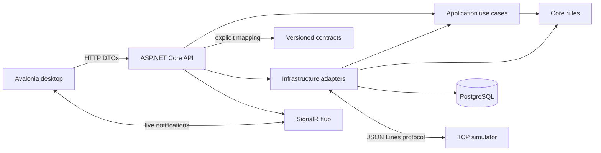

# Architecture

```mermaid
flowchart LR
    Desktop["Avalonia desktop"]
    Contracts["Versioned contracts"]
    API["ASP.NET Core API"]
    Application["Application use cases"]
    Core["Core rules"]
    Infrastructure["Infrastructure adapters"]
    Database[("PostgreSQL")]
    Simulator["TCP simulator"]
    Hub["SignalR hub"]

    Desktop -->|"HTTP DTOs"| API
    Desktop <-->|"live notifications"| Hub
    API --> Application
    API -->|"explicit mapping"| Contracts
    Application --> Core
    Infrastructure --> Application
    Infrastructure --> Core
    Infrastructure --> Database
    Infrastructure <-->|"JSON Lines protocol"| Simulator
    API --> Infrastructure
    API --> Hub
```

Core is the centre of the dependency graph. Runtime calls can travel outward
through interfaces, but project references still point inward.
