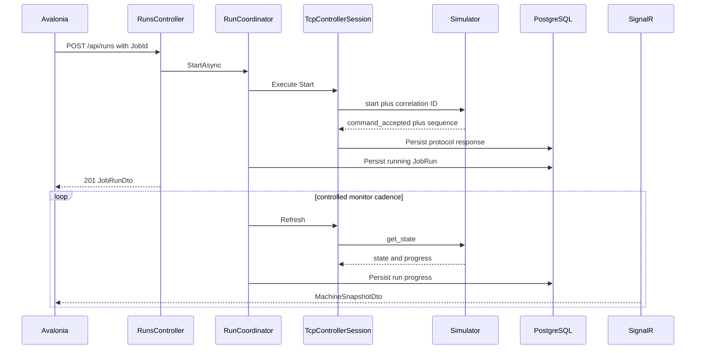
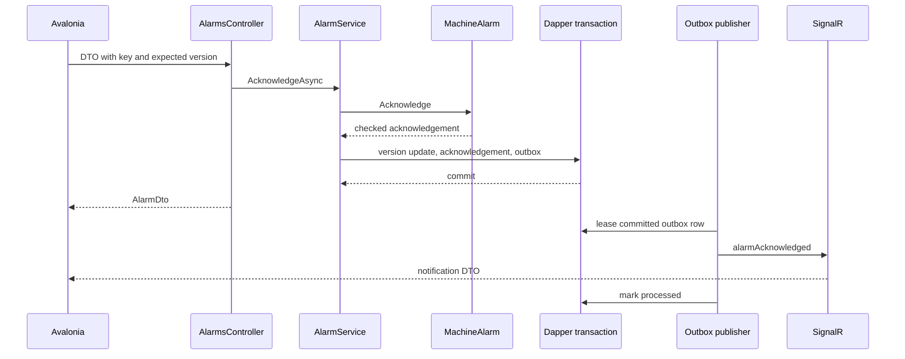
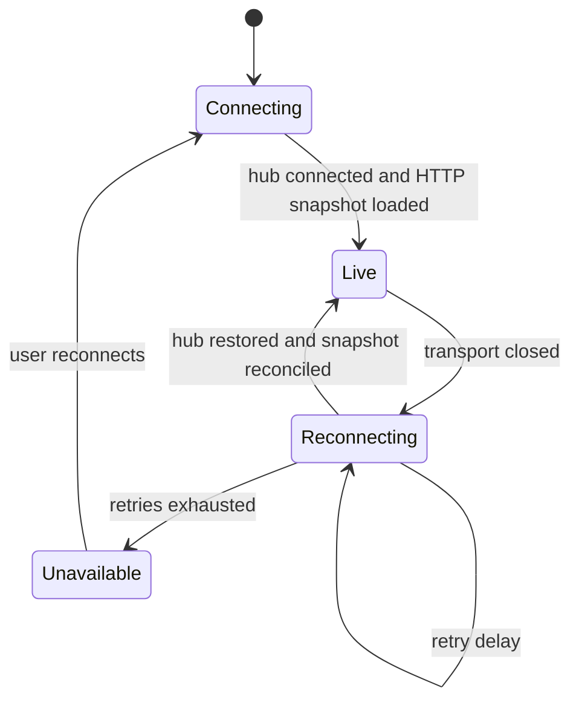

# Critical flows

## Start a run and return live state

```mermaid
sequenceDiagram
    participant UI as Avalonia
    participant API as RunsController
    participant App as RunCoordinator
    participant TCP as TcpControllerSession
    participant Sim as Simulator
    participant DB as PostgreSQL
    participant Hub as SignalR

    UI->>API: POST /api/runs with JobId
    API->>App: StartAsync
    App->>TCP: Execute Start
    TCP->>Sim: start plus correlation ID
    Sim-->>TCP: command_accepted plus sequence
    TCP->>DB: Persist protocol response
    App->>DB: Persist running JobRun
    API-->>UI: 201 JobRunDto
    loop controlled monitor cadence
        App->>TCP: Refresh
        TCP->>Sim: get_state
        Sim-->>TCP: state and progress
        App->>DB: Persist run progress
        Hub-->>UI: MachineSnapshotDto
    end
```

## Acknowledge an alarm

```mermaid
sequenceDiagram
    participant UI as Avalonia
    participant API as AlarmsController
    participant App as AlarmService
    participant Core as MachineAlarm
    participant DB as Dapper transaction
    participant Worker as Outbox publisher
    participant Hub as SignalR

    UI->>API: DTO with key and expected version
    API->>App: AcknowledgeAsync
    App->>Core: Acknowledge
    Core-->>App: checked acknowledgement
    App->>DB: version update, acknowledgement, outbox
    DB-->>App: commit
    API-->>UI: AlarmDto
    Worker->>DB: lease committed outbox row
    Worker->>Hub: alarmAcknowledged
    Hub-->>UI: notification DTO
    Worker->>DB: mark processed
```

## Reconnect and resynchronise

```mermaid
stateDiagram-v2
    [*] --> Connecting
    Connecting --> Live: hub connected and HTTP snapshot loaded
    Live --> Reconnecting: transport closed
    Reconnecting --> Reconnecting: retry delay
    Reconnecting --> Live: hub restored and snapshot reconciled
    Reconnecting --> Unavailable: retries exhausted
    Unavailable --> Connecting: user reconnects
```
